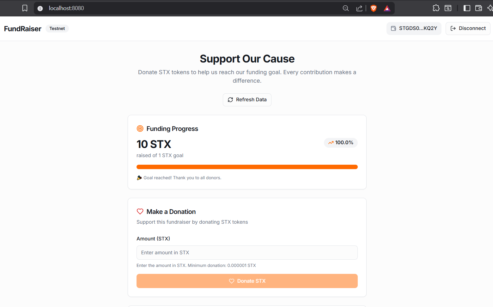
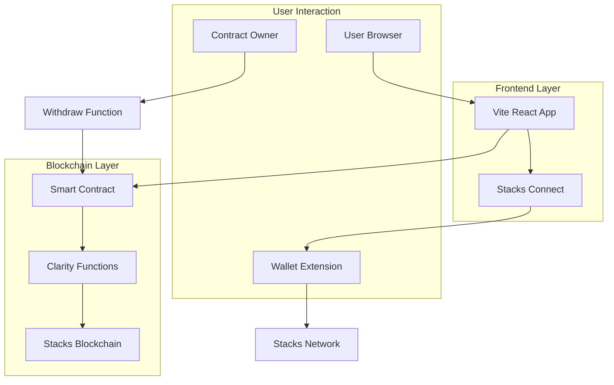
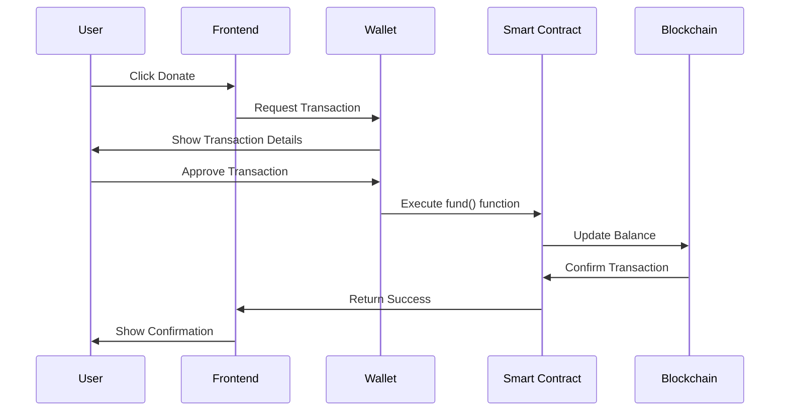
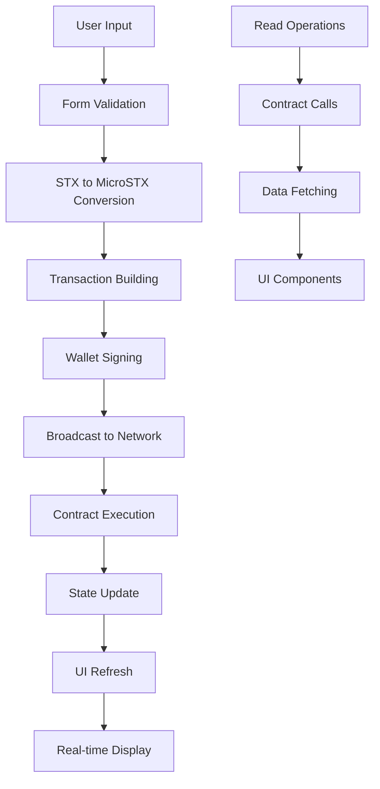
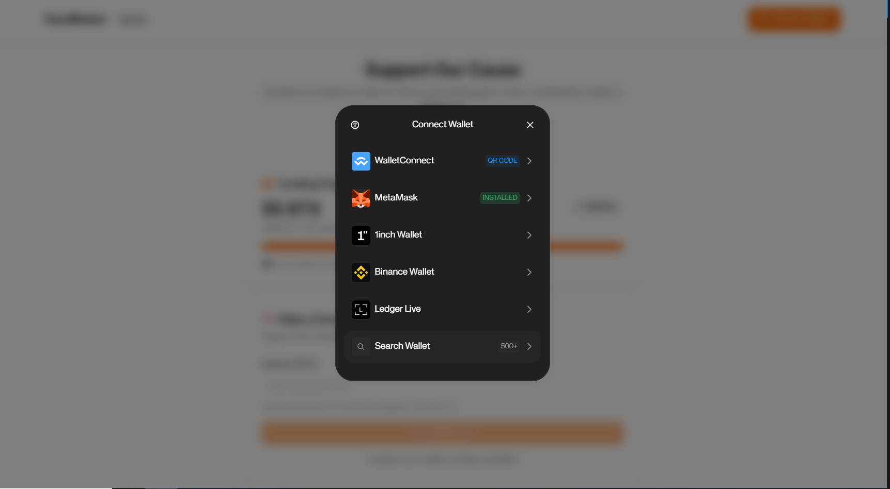

# Stacks FundRaiser dApp

[](https://stacks.co)
[](https://www.typescriptlang.org/)
[](https://reactjs.org/)
[](https://vitejs.dev/)
[](https://tailwindcss.com/)
[](https://fundraiser-d-app-kappa.vercel.app)

Production-ready decentralized fundraising on Stacks. Users can connect wallets using Stacks Connect or WalletConnect via Reown AppKit.

**Live Demo**: [fundraiser-d-app-kappa.vercel.app](https://fundraiser-d-app-kappa.vercel.app)

## Table of Contents

- [Overview](#overview)
- [Architecture](#architecture)
- [Technology Stack](#technology-stack)
- [Prerequisites](#prerequisites)
- [Quick Start](#quick-start)
- [Usage Guide](#usage-guide)
- [Smart Contract Details](#smart-contract-details)
- [Configuration](#configuration)
- [Testing](#testing)
- [Contributing](#contributing)
- [Learning Resources](#learning-resources)
- [Stacks Builder Challenge #3](#stacks-builder-challenge-3)
- [Security](#security)
- [License](#license)
- [Acknowledgments](#acknowledgments)
- [Multi-Wallet Support (WalletConnect)](#multi-wallet-support-walletconnect)



## Overview

The Stacks FundRaiser dApp enables decentralized fundraising on Bitcoin L2 using Stacks smart contracts. Users contribute STX to campaigns with transparent on-chain tracking and a clear, accessible interface.

### Key Features

- Secure wallet integration via `@stacks/connect` (Leather and Xverse) and optional WalletConnect using Reown AppKit ^1.8.15
- Smart contract backed (Clarity on Stacks Testnet)
- Real-time fundraising progress and personal contribution tracking
- Modern UI using shadcn/ui and Tailwind CSS
- Testnet/Mainnet switchable configuration
- Responsive layout optimized for desktop and mobile
- Fast builds and HMR with Vite

## Architecture

### System Architecture



### Contract Interaction Flow



### Data Flow Architecture



## Technology Stack

### Core Technologies
- Frontend Framework: React 18 with TypeScript
- Build Tool: Vite for fast development and optimized production builds
- Styling: Tailwind CSS with shadcn/ui component library
- State Management: React Query for server state management
- Form Handling: React Hook Form with Zod validation

### Stacks Integration
- Wallet Connection: `@stacks/connect` v7.10.2 (Stacks Connect for Leather/Xverse)
- Transaction Handling: `@stacks/transactions` v6.17.0
- Network Configuration: `@stacks/network` v6.17.0
- Smart Contracts: Clarity language on Stacks blockchain
- Multi-Wallet Support: Integrated wallet connection using `@reown/appkit` ^1.8.15, `@reown/appkit-adapter-bitcoin` ^1.8.15, and `@reown/appkit-adapter-wagmi` ^1.8.15 for enhanced compatibility



### Multi-Wallet Support (WalletConnect)
- WalletConnect via Reown AppKit ^1.8.15 for broader wallet compatibility and multi-chain support.

### Development Tools
- Linting: ESLint with TypeScript rules
- Code Formatting: Prettier (via ESLLint config)
- Package Manager: pnpm
- Type Checking: TypeScript strict mode

## Prerequisites

Before you begin, ensure you have the following installed:

- Node.js: Version 18.0.0 or higher
- pnpm: Modern package manager (install via `npm install -g pnpm`)
- Git: Version control
- Stacks Wallet: Leather or Xverse browser extension

### Getting Testnet STX

For testing the fundraiser functionality:

1. Visit the [Stacks Testnet Faucet](https://explorer.hiro.so/sandbox/faucet?chain=testnet)
2. Connect your testnet wallet
3. Request STX tokens for testing donations

## Quick Start

### 1. Clone the Repository

```bash
git clone <your-repository-url>
cd stacks-fundraiser2
```

### 2. Install Dependencies

```bash
pnpm install
```

### 3. Start Development Server

```bash
pnpm dev
```

### 4. Open in Browser

Navigate to `http://localhost:5173` to see the application running.

### 5. Connect Wallet and Test

1. Click "Connect Wallet" in the app
2. Approve the connection in your wallet extension
3. Make a test donation with STX tokens

## Usage Guide

### For Contributors (Donors)

1. **Connect Wallet**: Use the "Connect Wallet" button to link your Leather or Xverse wallet
2. **View Progress**: See the current fundraising progress and goal
3. **Make Donation**: Enter STX amount and confirm the transaction
4. **Track Contribution**: View your personal donation history

### For Campaign Owners

1. **Deploy Contract**: Deploy the Clarity smart contract to Stacks network
2. **Configure App**: Update contract address in `src/lib/stacks.ts`
3. **Launch Campaign**: Set your fundraising goal and start accepting donations
4. **Withdraw Funds**: Use the owner controls to withdraw collected STX

## Smart Contract Details

### Contract Information
- **Network**: Stacks Testnet
- **Address**: `STGDS0Y17973EN5TCHNHGJJ9B31XWQ5YXBQ0KQ2Y.fund-raiser`
- **Owner**: `STGDS0Y17973EN5TCHNHGJJ9B31XWQ5YXBQ0KQ2Y`
- **Language**: Clarity

### Contract Functions

| Function | Type | Parameters | Description |
|----------|------|------------|-------------|
| `fund` | Public | `amount: uint` | Donate STX to the fundraiser |
| `withdraw` | Public | None | Owner-only: Withdraw all collected funds |
| `get-balance` | Read-only | None | Returns current total balance in microSTX |
| `get-goal` | Read-only | None | Returns the fundraising goal in microSTX |
| `get-owner` | Read-only | None | Returns the contract owner's address |
| `get-donor-amount` | Read-only | `donor: principal` | Returns a specific donor's total contribution |

### Contract Security Features

- **Owner-only Withdrawals**: Only the contract owner can withdraw funds
- **Immutable Goal**: Fundraising goal is set at deployment and cannot be changed
- **Transparent Tracking**: All donations are publicly visible on-chain
- **No External Dependencies**: Pure Clarity implementation with no external calls

## Configuration

### Network Switching

To deploy on Mainnet, update `src/lib/stacks.ts`:

```typescript
// Change to true for mainnet deployment
export const IS_MAINNET = true;

// Update contract details for mainnet
export const CONTRACT_ADDRESS = "YOUR_MAINNET_CONTRACT_ADDRESS";
export const CONTRACT_OWNER = "YOUR_MAINNET_OWNER_ADDRESS";
```

### Environment Variables

Create a `.env.local` file for custom configurations:

```bash
# Optional: Custom API endpoints
VITE_STACKS_API_URL=https://api.mainnet.stacks.co
VITE_STACKS_EXPLORER_URL=https://explorer.stacks.co
```

## Testing

### Automated Testing

```bash
# Run unit tests
pnpm test

# Run tests with coverage
pnpm test:coverage

# Run E2E tests (if configured)
pnpm test:e2e
```

### Manual Testing Checklist

- [ ] Wallet connection works with Leather
- [ ] Wallet connection works with Xverse
- [ ] Donation transaction completes successfully
- [ ] Balance updates in real-time
- [ ] Progress bar reflects correct percentage
- [ ] Owner withdrawal works for contract owner
- [ ] Error handling for insufficient funds
- [ ] Network switching between testnet/mainnet

## Contributing

We welcome contributions from the Stacks community! This project is designed to help builders learn and collaborate.

### Ways to Contribute

1. **🐛 Bug Reports**: Found an issue? [Open a GitHub issue](https://github.com/your-repo/issues)
2. **✨ Feature Requests**: Have an idea? [Start a discussion](https://github.com/your-repo/discussions)
3. **🔧 Code Contributions**: See our [Contributing Guide](./CONTRIBUTING.md)
4. **📚 Documentation**: Help improve this README or add tutorials
5. **🧪 Testing**: Add test cases or help with QA

### Development Workflow

1. Fork the repository
2. Create a feature branch: `git checkout -b feature/amazing-feature`
3. Make your changes and add tests
4. Ensure all tests pass: `pnpm test`
5. Commit your changes: `git commit -m 'Add amazing feature'`
6. Push to the branch: `git push origin feature/amazing-feature`
7. Open a Pull Request

### Code Standards

- **TypeScript**: Strict type checking enabled
- **ESLint**: All linting rules must pass
- **Prettier**: Code formatting via ESLint
- **Conventional Commits**: Use semantic commit messages

## Learning Resources

### For Beginners
- [Stacks Documentation](https://docs.stacks.co/) - Official Stacks docs
- [Clarity Language Guide](https://clarity-lang.org/) - Learn smart contract development
- [React Documentation](https://react.dev/) - Frontend framework basics

### For Builders
- [Stacks.js SDK](https://github.com/hirosystems/stacks.js) - JavaScript libraries
- [Stacks Connect](https://connect.hiro.so/) - Wallet integration guide
- [Stacks Explorer](https://explorer.stacks.co/) - Blockchain explorer

### For Learners
- [Stacks University](https://university.stacks.org/) - Educational content
- [Discord Community](https://discord.gg/stacks) - Get help from the community
- [GitHub Discussions](https://github.com/your-repo/discussions) - Ask questions here

## Stacks Builder Challenge #3

This project is optimized for maximum rewards in the Stacks Builder Challenge #3!

### How Rewards Are Calculated

Rewards are based on your leaderboard position, determined by activity across:

#### Smart Contract Impact
- Deployed Contracts: Quality and complexity of Clarity smart contracts
- On-chain Activity: Transaction volume and user engagement
- Contract Design: Security, efficiency, and innovative features

#### Stacks SDK Usage
- @stacks/connect Integration: Seamless wallet connections
- @stacks/transactions: Contract interaction patterns
- @stacks/network: Proper network configuration and handling

#### GitHub Contributions
- Public Repository Activity: Code commits, issues, and pull requests
- Documentation Quality: Comprehensive READMEs and guides
- Community Engagement: Helping other builders and learners

### Optimization Strategies

- Emphasize @stacks/connect usage: wallet connection patterns implemented
- Robust @stacks/transactions usage: contract calls with error handling
- Production practices: TypeScript, tests, documentation
- Open source focus: issues, PRs, discussions welcomed
- Educational value: learning resources and clear docs

### Leaderboard Signals and Verification

- Uses `@stacks/connect` v7.10.2 and `@stacks/transactions` v6.17.0 (see package.json)
- Optional support for Reown AppKit (WalletConnect). Recommended version range: `^1.0.0`
- Public repository activity encouraged via issues and pull requests
- Smart contract activity visible via Stacks Explorer

## Security

### Smart Contract Security
- Audit ready: follows Clarity best practices
- Access control: owner-only functions enforced
- Input validation: parameters validated before execution

### Frontend Security
- Type safety: full TypeScript coverage
- Input sanitization: validated and sanitized inputs
- Wallet security: no private keys stored; operations via wallet

### Best Practices
- Post conditions: implement for production
- Error handling: comprehensive across the app
- Testing: thorough before mainnet deployment

## License

This project is licensed under the MIT License - see the [LICENSE](./LICENSE) file for details.

## Acknowledgments

- Stacks Foundation for the blockchain infrastructure
- Hiro Systems for developer tools and wallet integration
- shadcn for the UI component library
- The Stacks community for support and inspiration

---

Built for the Stacks ecosystem.

[](https://stacks.co)
[](https://clarity-lang.org/)

---

## Multi-Wallet Support (WalletConnect)

This project supports wallet connections via Stacks Connect (`@stacks/connect`) for Stacks-native wallets and Reown AppKit for broader multi-wallet and multi-chain experiences.

- Package: `@reown/appkit` ^1.8.15 (recommended version range: `^1.8.15`)
- React bindings: `@reown/appkit-react`

Install:

```bash
pnpm add @reown/appkit@^1.8.15 @reown/appkit-react@^1.8.15
```

Notes:
- Users can connect using both Stacks Connect for Stacks-native wallets (Leather/Xverse) and Reown AppKit for broader wallet compatibility, aligning with leaderboard tracking for "Use of WalletKit SDK or Reown AppKit".
- Refer to official Reown documentation for initialization and provider configuration.
